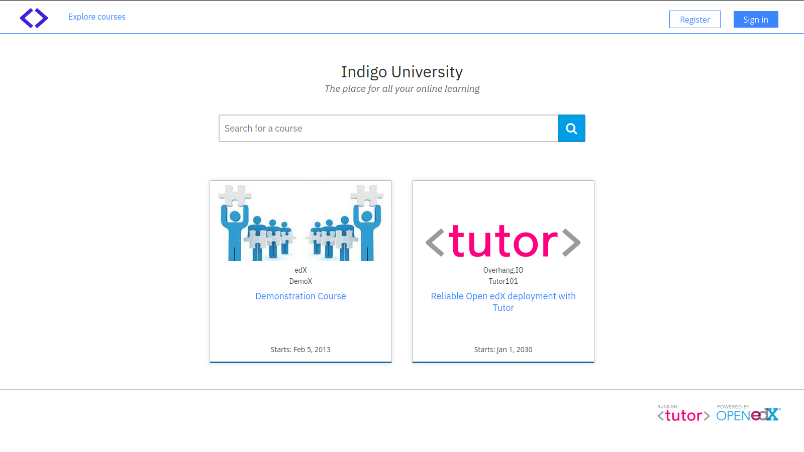

Indigo, a cool blue theme for Open edX
======================================

Indigo is an elegant, customizable theme for `Open edX <https://open.edx.org>`__.

**Note**: This version of the Indigo theme is compatible with the Juniper release of Open edX.

Installation
------------

Indigo was specially developed to be used with `Tutor <https://docs.overhang.io>`__ (at least v3.11.1). If you have not installed Open edX with Tutor, then installation instructions will vary.

Clone the theme repository::

    git clone https://github.com/overhangio/indigo

Render your theme::

    tutor config render --extra-config ./indigo/config.yml ./indigo/theme "$(tutor config printroot)/env/build/openedx/themes/indigo"

Rebuild the Openedx docker image::

    tutor images build openedx

Restart your platform::

    tutor local start -d

You will then have to enable the "indigo" theme, as per the `Tutor documentation <https://docs.tutor.overhang.io/local.html#setting-a-new-theme>`__::

    tutor local settheme indigo localhost studio.localhost \
        $(tutor config printvalue LMS_HOST) $(tutor config printvalue CMS_HOST)

Upgrade
-------

To upgrade the Indigo theme from a previous version, simply pull the changes from the git repository::

    cd indigo/
    git pull

Then run the commands above starting from ``tutor config render...``.

Customization
-------------

Setting custom values
~~~~~~~~~~~~~~~~~~~~~

A few settings in the theme can be easily customised: this includes the theme primary color, landing page tagline, footer legal links. Theme settings are defined in the `config.yml <https://github.com/overhangio/indigo/blob/master/config.yml>`__ file at the root of the repository. You can override all or part of those settings by creating you own ``config-custom.yml`` file. Then, render the theme with::

    tutor config render \
        --extra-config ./indigo/config.yml \
        --extra-config ./indigo/config-custom.yml \
        ./indigo/theme "$(tutor config printroot)/env/build/openedx/themes/indigo"

Changing the default logo and other images
~~~~~~~~~~~~~~~~~~~~~~~~~~~~~~~~~~~~~~~~~~

The theme images are stored in `indigo/theme/lms/static/images <https://github.com/overhangio/indigo/tree/master/theme/lms/static/images>`__ for the LMS, and in `indigo/theme/cms/static/images <https://github.com/overhangio/indigo/tree/master/theme/cms/static/images>`__ for the CMS. To use custom images in your theme, just replace the files stored in these folders with your own prior to running ``tutor config render``.

Overriding the default "about", "contact", etc. static pages
~~~~~~~~~~~~~~~~~~~~~~~~~~~~~~~~~~~~~~~~~~~~~~~~~~~~~~~~~~~~

By default, the ``/about`` and ``/contact`` pages contain a simple line of text: "This page left intentionally blank. Feel free to add your own content". This is of course unusable in production. In the following, we detail how to override just any of the static templates used in Open edX.

The static templates used by Open edX to render those pages are all stored in the `edx-platform/lms/templates/static_templates <https://github.com/edx/edx-platform/tree/open-release/juniper.master/lms/templates/static_templates>`__ folder. To override those templates, you should add your own in the following folder::

    ls "$(tutor config printroot)/env/build/openedx/themes/indigo/lms/templates/static_templates"

For instance, edit the "donate.html" file in this directory. We can derive the content of this file from the contents of the `donate.html <https://github.com/edx/edx-platform/blob/open-release/juniper.master/lms/templates/static_templates/donate.html>`__ static template in edx-platform::

    <%page expression_filter="h"/>
    <%! from django.utils.translation import ugettext as _ %>
    <%inherit file="../main.html" />

    <%block name="pagetitle">${_("Donate")}</%block>

    <main id="main" aria-label="Content" tabindex="-1">
        <section class="container about">
            <h1>
                <%block name="pageheader">${page_header or _("Donate")}</%block>
            </h1>
            

                <%block name="pagecontent">Add a compelling message here, asking for donations.</%block>
            

        </section>
    </main>

This new template will then be used to render the /donate url.

License
-------

This work is licensed under the terms of the `GNU Affero General Public License (AGPL) <https://github.com/overhangio/indigo/blob/master/LICENSE.txt>`_.